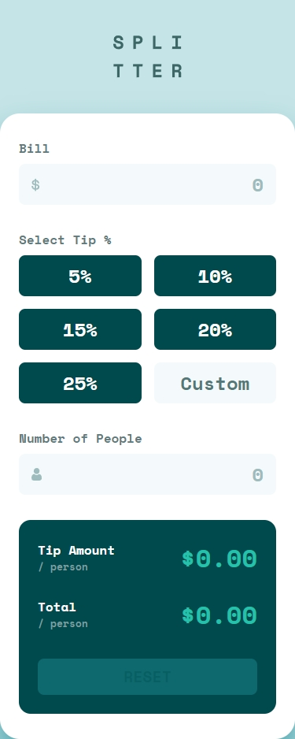
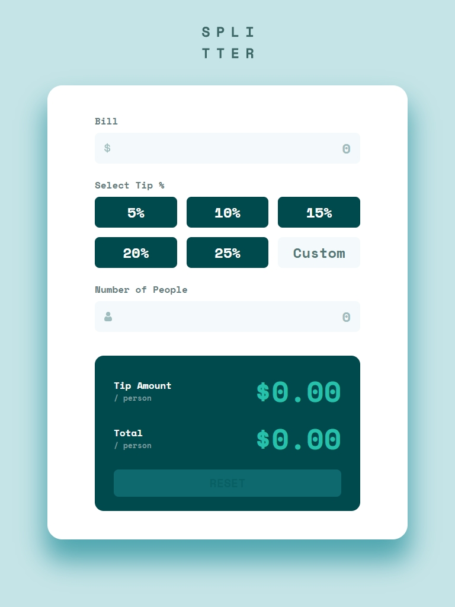
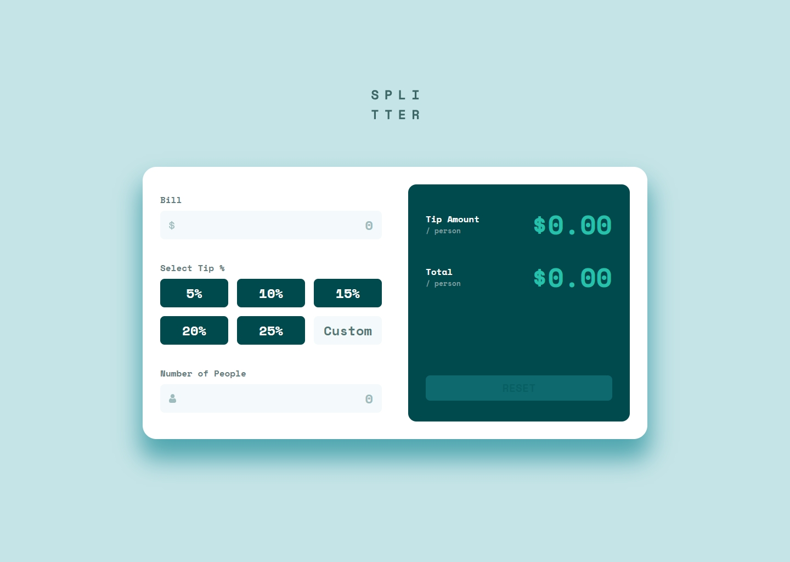

# Frontend Mentor - Tip calculator app solution

This is a solution to the [Tip calculator app challenge on Frontend Mentor](https://www.frontendmentor.io/challenges/tip-calculator-app-ugJNGbJUX). Frontend Mentor challenges help you improve your coding skills by building realistic projects.

## Table of contents

- [Overview](#overview)
  - [The challenge](#the-challenge)
  - [Screenshot](#screenshot)
  - [Links](#links)
- [My process](#my-process)
  - [Built with](#built-with)
  - [What I learned](#what-i-learned)
  - [Continued development](#continued-development)
  - [Useful resources](#useful-resources)

## Overview

### The challenge

Users should be able to:

- View the optimal layout for the app depending on their device's screen size
- See hover states for all interactive elements on the page
- Calculate the correct tip and total cost of the bill per person

### Screenshot





### Links

- Solution URL: [https://github.com/skhbabez/tip-calculator-app-main](https://github.com/skhbabez/tip-calculator-app-main)
- Live Site URL: [https://skhbabez.github.io/tip-calculator-app-main/](https://skhbabez.github.io/tip-calculator-app-main/)

## My process

### Built with

- Semantic HTML5 markup
- CSS custom properties
- Flexbox
- CSS Grid
- Mobile-first workflow
- javascript

### What I learned

I learned how to write some more complex validation logic, using some of the refactoring logic taught on frontendmentor in the process.

```js
const validations = {
  bill: (bill) => isNumber(bill) && bill > 0,
  people: (people) => isNumber(people) && people % 1 === 0 && people > 0,
  tip: (tip) => isNumber(tip) && tip >= 0,
};
```

I am proud of the way I solved the tip button list and the custom button, ensuring they act in tandem.

```js
const resetToggles = () => {
  tipButtons.forEach((btn) => {
    btn.checked = false;
  });
};

const handleTip = (event) => {
  if (event.currentTarget.name === "tip") {
    customInput.value = "";
  }
  if (event.currentTarget.name === "tip-custom") {
    resetToggles();
  }
  updateResult();
};
```

### Continued development

I need to fócus on writing cleaner code in css. While I like my solutions in geneal a lot better now, they still lack maintainability (especially when it comes to using custom properties). I am also not particularly happy with the way I wrote my javascript and I am looking for a cleaner solution handling the form state.

### Useful resources

- [https://www.geeksforgeeks.org/javascript/number-validation-in-javascript/](https://www.example.com) - This helped me figure out how to check if a string is a valid number in javascript.
